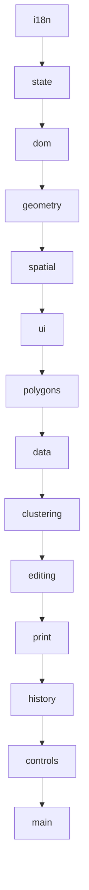

# OSM App / Territory Mapper

- [German/Deutsch](#deutsch)
- [Polish/Polski](#polski)

|              Screenshots              |
|:-------------------------------------:|
|  |
|          Territory clusters           |
|  |
|        Printing territory card        |
|  |
|          Using card template          |
|  |
|  Using search to draw territory area  |

Split a map area into walkable territories, then print each one as a card.

## What it does

You draw a shape on a map — a neighborhood, a village, a few blocks. The app
downloads the real streets and buildings inside it from OpenStreetMap, then cuts
the shape into however many pieces you ask for.

The cuts follow actual streets. That is the whole point: a territory whose edge
runs down the middle of a street is useless to the person walking it, because
they cannot tell which houses are theirs. Every boundary here runs _along_ a
road, so "everything on this side of Railway Avenue" is an instruction you can
act on.

Then you print. Each territory becomes a PDF card showing that territory alone,
at a zoom level that fits the page, with the boundary drawn on top. You can drop
those onto a pre-printed form — an existing card template — so the map lands
inside the box the template leaves for it.

## Who it's for

Anyone who divides a geographic area into assignments and hands them to people
on foot: congregation field service, canvassing, leaflet distribution, survey
work, parish visiting, delivery rounds.

## What you actually do

1. **Draw the area.** Use the polygon tool and click around the edge of the
   region you care about. Double-click to close it.
2. **Wait for the data.** Streets and buildings load from OpenStreetMap. A large
   town takes a few seconds; a city takes longer.
3. **Split it.** Choose either a number of territories ("give me 40") or a
   target size ("about 25 buildings each") and let it run. Bigger areas and
   higher counts take longer — a few hundred territories is a couple of minutes.
4. **Adjust by hand.** Merge two territories that came out too small, cut one
   that came out too big, drag a boundary, or delete one entirely. Ctrl+Z undoes.
5. **Print.** Right-click a territory and choose Print. Set the line color and
   thickness, rotate or zoom the map inside the frame, erase any bit of the
   border that covers something you need to read, and export the PDF.

Your work is kept in the browser, so a refresh or an accidental tab close does
not lose it. You can also export everything to a file and load it back later, on
another machine.

## What it is not

It does not know who lives where, track visits, or store anything about
residents. It draws boundaries and prints maps. Anything about the people inside
those boundaries stays wherever you already keep it.

It also does not invent street data. Everything comes from OpenStreetMap, so if
a new estate is missing there, it is missing here. That is fixable — OpenStreetMap
is editable by anyone — but it is fixed there, not here.

## Language

Available in English, Polish and German. Pick one from the menu, or go straight
to `/pl` or `/de`.

---

## Deutsch

Teilt einen Kartenbereich in begehbare Gebiete auf und druckt jedes einzelne als
Karte aus.

### So funktioniert es

Ihr zeichnet eine Form auf einer Karte ein – ein Stadtviertel, ein Dorf, ein paar
Häuserblocks. Die App lädt die tatsächlichen Straßen und Gebäude innerhalb dieser
Form aus OpenStreetMap herunter und teilt die Form dann in so viele Teile auf, wie
ihr wünscht.

Die Aufteilung folgt den tatsächlichen Straßen. Das ist der springende Punkt: Ein
Gebiet, dessen Grenze in der Mitte einer Straße verläuft, ist für den Fußgänger
nutzlos, da er nicht erkennen kann, welche Häuser zu ihm gehören. Jede Grenze verläuft
hier _entlang_ einer Straße, sodass „alles auf dieser Seite der Bahnstraße“ eine
Anweisung ist, nach der man handeln kann.

Dann druckst du. Jedes Gebiet wird zu einer PDF-Karte, die nur dieses Gebiet zeigt,
in einer Zoomstufe, die auf die Seite passt, mit der darüber eingezeichneten Grenze.
Du kannst diese auf ein vorgedrucktes Formular – eine vorhandene Kartenvorlage –
ziehen, sodass die Karte genau in das Feld passt, das die Vorlage dafür vorsieht.

### Für wen ist es gedacht

Jeder, der ein geografisches Gebiet in Aufgabenbereiche unterteilt und diese an
Personen vor Ort verteilt: Gemeindedienst, Wahlwerbung, Flugblattverteilung, Umfragen,
Gemeindebesuche, Auslieferungsrunden.

### Was du konkret tust

1. **Zeichne das Gebiet ein.** Verwende das Polygon-Werkzeug und klicke entlang
   der Ränder der Region, die dich interessiert. Doppelklicke, um sie zu schließen.
2. **Warten Sie auf die Daten.** Straßen und Gebäude werden aus OpenStreetMap geladen.
   Bei einer größeren Stadt dauert es ein paar Sekunden; bei einer Großstadt etwas
   länger.
3. **Teilen Sie das Gebiet auf.** Wählen Sie entweder eine Anzahl von Gebieten
   („40 bitte“) oder eine Zielgröße („jeweils etwa 25 Gebäude“) und lassen Sie das
   Programm laufen. Größere Gebiete und höhere Stückzahlen dauern länger – ein paar
   hundert Gebiete brauchen ein paar Minuten.
4. **Passen Sie die Gebiete manuell an.** Füge zwei Gebiete zusammen, die zu klein
   geworden sind, teile eines auf, das zu groß geworden ist, verschiebe eine Grenze
   oder lösche ein Gebiet komplett. Mit Strg+Z kannst du den Vorgang rückgängig
   machen.
5. **Drucken.** Klicke mit der rechten Maustaste auf ein Gebiet und wähle „Drucken“.
   Lege die Linienfarbe und -stärke fest, drehe oder zoome die Karte innerhalb des
   Rahmens, lösche Teile der Umrandung, die etwas verdecken, das du lesen musst,
   und exportiere die PDF-Datei.

Deine Arbeit wird im Browser gespeichert, sodass sie durch eine Aktualisierung oder
das versehentliche Schließen des Tabs nicht verloren geht. Du kannst auch alles
in eine Datei exportieren und später auf einem anderen Rechner wieder laden.

### Was es nicht ist

Es weiß nicht, wer wo wohnt, verfolgt keine Besuche und speichert keine
Informationen über Einwohner. Es zeichnet Grenzen und druckt Karten. Alles, was
die Menschen innerhalb dieser Grenzen betrifft, bleibt dort, wo du es bereits aufbewahrst.

Es erfindet auch keine Straßendaten. Alles stammt aus OpenStreetMap; wenn also
eine neue Wohnsiedlung dort fehlt, fehlt sie auch hier. Das lässt sich beheben –
OpenStreetMap kann von jedem bearbeitet werden –, aber es wird dort korrigiert,
nicht hier.

### Sprache

Verfügbar auf Englisch, Polnisch und Deutsch. Wähle eine Sprache aus dem Menü
aus oder gehe direkt zu `/pl` oder `/de`.

---

## Polski

Podziel obszar mapy na terytoria, po których można się poruszać pieszo, a
następnie wydrukuj każde z nich jako kartę.

### Jak to działa

Rysujesz na mapie kształt — dzielnicę, wieś, kilka przecznic. Aplikacja
pobiera z OpenStreetMap rzeczywiste ulice i budynki znajdujące się w jego
obrębie, a następnie dzieli
ten kształt na tyle części, ile zlecisz.

Podział przebiega wzdłuż rzeczywistych ulic. I o to właśnie chodzi: obszar,
którego granica biegnie środkiem ulicy, jest bezużyteczny dla osoby poruszającej
się pieszo, ponieważ nie jest w stanie rozpoznać, które domy należą do niej.
Każda granica przebiega tutaj _wzdłuż_ drogi, więc „wszystko po tej stronie Kolejowej”
to wskazówka, którą można wykorzystać w praktyce.

Następnie drukujesz. Każdy obszar staje się kartą w formacie PDF przedstawiającą
wyłącznie ten obszar, w powiększeniu dopasowanym do strony, z narysowaną na wierzchu
granicą. Możesz umieścić je na wcześniej wydrukowanym formularzu — istniejącym
szablonie karty — tak, aby mapa znalazła się w polu przeznaczonym dla niej w szablonie.

### Dla kogo to jest

Każdy, kto dzieli obszar geograficzny na zadania i przydziela je osobom
poruszającym się pieszo: służba terenowa zboru, akcje informacyjne, rozdawanie ulotek,
prace ankietowe, wizyty parafialne, trasy dostawcze.

### Co faktycznie robisz

1. **Narysuj obszar.** Użyj narzędzia wielokąta i klikaj wzdłuż krawędzi
   regionu, który Cię interesuje. Kliknij dwukrotnie, aby go zamknąć.
2. **Poczekaj na dane.** Ulice i budynki są pobierane z OpenStreetMap. W przypadku
   dużego miasteczka zajmuje to kilka sekund; w przypadku miasta trwa to dłużej.
3. **Podziel obszar.** Wybierz liczbę terytoriów („daj mi 40”) lub
   docelową wielkość („około 25 budynków na każde”) i uruchom proces. Większe
   obszary i większa liczba terytoriów zajmują więcej czasu — kilkaset terytoriów
   to kilka minut.
4. **Dopasuj ręcznie.** Połącz dwa obszary, które okazały się zbyt małe, podziel
   jeden, który okazał się zbyt duży, przeciągnij granicę lub całkowicie usuń jeden
   z nich. Ctrl+Z cofa zmianę.
5. **Wydrukuj.** Kliknij prawym przyciskiem myszy na obszar i wybierz opcję „Drukuj”.
   Ustaw kolor i grubość linii, obróć lub powiększ mapę w ramce, usuń fragmenty
   obramowania zasłaniające tekst, który chcesz odczytać, a następnie wyeksportuj
   plik PDF.

Twoja praca jest zapisywana w przeglądarce, więc odświeżenie strony lub przypadkowe
zamknięcie karty nie spowoduje jej utraty. Możesz również wyeksportować wszystko
do pliku i załadować go później na innym komputerze.

### Czym to nie jest

Narzędzie to nie wie, kto gdzie mieszka, nie śledzi wizyt ani nie przechowuje
żadnych danych dotyczących mieszkańców. Wyznacza granice i drukuje mapy. Wszystkie
informacje o osobach znajdujących się w obrębie tych granic pozostają tam, gdzie
je przechowujesz.

Narzędzie to nie tworzy również danych dotyczących ulic. Wszystkie informacje
pochodzą z OpenStreetMap, więc jeśli brakuje tam nowego osiedla, nie ma go również
tutaj. Można to naprawić — OpenStreetMap może edytować każdy — ale zostanie to
poprawione tam, a nie tutaj.

### Język

Dostępne w języku angielskim, polskim i niemieckim. Wybierz jeden z menu lub
przejdź bezpośrednio do `/pl` lub `/de`.

---

## Setup

```bash
pip install .
osmapp
```

### Configuration

All optional, all environment variables.

| Variable           | Default                                          | Why you'd change it                                                                                                                    |
|--------------------|--------------------------------------------------|----------------------------------------------------------------------------------------------------------------------------------------|
| `OSM_MAX_AREA_KM2` | `50`                                             | Polygons above this are refused up front. Overpass on a large area can pull hundreds of megabytes and hang for the full 180 s timeout. |
| `OVERPASS_URL`     | `https://overpass-api.de/api`                    | Point at a mirror or your own instance.                                                                                                |
| `TILE_URL`         | `https://tile.openstreetmap.org/{z}/{x}/{y}.png` | See _Tile usage_ below.                                                                                                                |
| `TILE_CACHE_DIR`   | `.tile_cache`                                    | Where proxied tiles are stored.                                                                                                        |
| `HOST` / `PORT`    | `127.0.0.1` / `5000`                             |                                                                                                                                        |
| `FLASK_DEBUG`      | `0`                                              | `1` enables the Werkzeug debugger. Never on anything reachable.                                                                        |

### Tile usage

Printing renders the basemap onto a canvas, so tiles are fetched through
`/tiles/...` rather than by Leaflet. The proxy exists for three reasons: it
keeps the canvas same-origin so `toBlob()` isn't blocked by tainting, it puts
custom User-Agent on the requests, and it caches to disk so reprinting a
territory costs nothing.

The OSM tile policy discourages proxying and forbids bulk downloads. One card
is roughly 350 tiles across a whole editing session, which is fine for
occasional personal use. **If you print territories in volume, set `TILE_URL`
to your own or a commercial tile source.** Attribution is burned into every
rendered image.

---

## Layout

```text
*.py                      Flask: Overpass proxy, geocoding, tiles, PDF composition
templates/index.html      Page shell + every piece of UI markup as <template>
static/css/style.css      All styling; design tokens at the top
static/lang/{en,pl,de}.json
static/js/                One IIFE module per file, namespaced under window.App
static/cdn/               Vendored Leaflet plugins and Turf — no CDN at runtime
```

### Modules

Load order matters and is fixed in `index.html`:



| Module       | Responsibility                                                     |
|--------------|--------------------------------------------------------------------|
| `i18n`       | Dictionary loading, `t()`, translating DOM subtrees                |
| `state`      | The single mutable store. Everything else reads `App.state`        |
| `dom`        | Clones `<template>` elements, looks nodes up by `data-role`        |
| `geometry`   | Turf wrappers, polygon normalization, planar segment noding        |
| `spatial`    | Uniform grid index, fast planar distance, binary min-heap          |
| `ui`         | Loading overlay, info panel, context menu, dialogs                 |
| `polygons`   | Territory lifecycle, hover info, the filtered street/building view |
| `data`       | Overpass fetching, rendering, GeoJSON export/import                |
| `clustering` | K-Means → Voronoi → street-routed boundaries                       |
| `editing`    | Cut lines, merging, cleanup                                        |
| `print`      | Canvas map rendering, framing, eraser, PDF composition             |
| `history`    | Undo/redo                                                          |
| `controls`   | Toolbar, language picker, reset                                    |
| `main`       | Boot sequence and map wiring                                       |

---

## How the pieces work

### Splitting into territories

Six phases, each yielding to the event loop so the UI stays responsive:

1. **Sample points** — building centroids, falling back to street midpoints and
   then boundary samples when an area is sparse.
2. **K-Means** → _k_ centroids.
3. **Voronoi** → cells, clipped to the outer boundary.
4. **Street graph** — an undirected weighted graph with a grid index.
5. **Edge routing** — every unique cell edge is routed along streets with A\*,
   biased toward the edge's original bearing.
6. **Polygonize** → assign pieces to centroids → fill gaps → render.

Phase 5 routes each edge **once**, keyed on its sorted endpoint pair. Adjacent
Voronoi cells share edges, and routing each cell's copy independently let A\*
return two different paths for the same edge — which breaks the planar graph
and makes `polygonize` miss rings entirely.

### Merging

`geometry.unionHealed()` grows each input by 0.5 m before unioning and shrinks
back after. A plain `turf.union` on territories whose shared boundary only
_nearly_ coincides returns a MultiPolygon of touching pieces, and Leaflet then
draws the internal outlines. Growing first closes gaps under a metre so the
union genuinely dissolves.

### Printing

The card is **rendered from scratch onto a canvas**, not screenshotted from
Leaflet. Two reasons: hiding layers can't guarantee a neighboring border stays
out of frame, whereas drawing only this territory's rings can; and a screenshot
is capped at screen resolution, while the canvas renders at 300 dpi whatever
the window size.

Three surfaces compose the result:

- **tiles** — basemap plus attribution, never erasable
- **border** — the line on transparency, with erased spans punched out using
  `destination-out`, so erasing removes the line and leaves the map beneath
- **preview** — tiles, then border at the chosen opacity

The canvas is fixed at the template placeholder's aspect ratio, so **cropping
is choosing which slice of the world lands on it** — the ratio cannot drift.
Drag to pan, scroll or slide to zoom, two buttons for quarter turns.

Two details that are easy to get wrong:

**Tiles are fetched once.** One tile zoom is chosen when the dialog opens and
never changes; tiles are cached as decoded `Image` objects for the life of the
dialog, so every later adjustment re-composites from memory with no network.
The trade is softness when zooming past that level — `TILE_ZOOM_BOOST` buys one
more sharp zoom level for roughly four times the tiles.

**Erase strokes are stored in lng/lat with a width in metres**, not canvas
pixels. In pixel space, panning after erasing would slide every erasure off the
street name it was hiding.

---

## Translations

Markup is annotated declaratively:

```html
<span data-i18n="menu.print">Print</span>
<a data-i18n-attrs="title=toolbar.draw;aria-label=toolbar.draw"></a>
```

`App.dom.render()` translates every cloned template at mount time, so no module
has to remember. Strings built in JS go through `T("key", { count: 3 })`;
`{placeholders}` interpolate and numbers are localized via `Intl.NumberFormat`.

Language comes from the URL. Flask inlines the matching dictionary plus the
English fallback into the page, so there's no fetch waterfall and no
untranslated first paint. English always loads as a fallback, so a partial
translation degrades per key rather than showing raw key names.

Console output stays English on purpose — it's developer output, and
translating it makes issue reports harder to read.

**Adding a language**: copy `static/i18n/en.json`, translate it, and add
`{ code, label }` to `LANGUAGES` in `i18n.js` and to `SUPPORTED_LANGS` in
`app.py`. Nothing else; the picker and routing pick it up.

---

## HTTP API

| Route                        | Purpose                                                    |
|------------------------------|------------------------------------------------------------|
| `GET /`, `/pl`, `/de`        | The app. `/en` redirects to `/`                            |
| `POST /fetch_streets`        | GeoJSON polygon in, drivable street network out            |
| `POST /fetch_buildings`      | GeoJSON polygon in, building footprints with addresses out |
| `GET /geocode?q=`            | Nominatim proxy, cached and rate-limited to 1 req/s        |
| `GET /tiles/<z>/<x>/<y>.png` | Tile proxy with disk cache                                 |
| `POST /compose_pdf`          | Template PDF + PNG + placement → composed PDF              |

Both fetch endpoints require the polygon on **every** request. There is no
server-side geometry cache, deliberately: a module-level one meant two browser
tabs, or any multi-worker deployment, handed users each other's areas.

---

## Keyboard

|                                        |                                                                         |
|----------------------------------------|-------------------------------------------------------------------------|
| `Ctrl/Cmd + Z`                         | Undo — territory geometry, or the print eraser when that dialog is open |
| `Ctrl/Cmd + Y`, `Ctrl/Cmd + Shift + Z` | Redo                                                                    |
| `Esc`                                  | Cancel drawing, merge mode, or close a dialog                           |

---

## Known limits

- Territories are stored in memory. Export to GeoJSON to keep your work.
- The partitioner is tuned for urban areas with buildings. Rural areas fall
  back to street and boundary sampling and give coarser results.
- `/compose_pdf` assumes the placeholder is a rectangle on a single page.
  Multi-page or rotated placeholders need changes to `PLACEHOLDER` in
  `print.js` and to the composition step.
- Server-side error messages are English regardless of interface language. If
  that matters, return error _codes_ from the API and map them to `alert.*`
  keys client-side.

---

## Attribution

Map data © OpenStreetMap contributors, available under the
[Open Database License](https://www.openstreetmap.org/copyright). Attribution
is rendered into every printed map. Geocoding uses Nominatim; routing data and
building footprints come from Overpass. Please read those services' usage
policies before deploying this anywhere shared.
