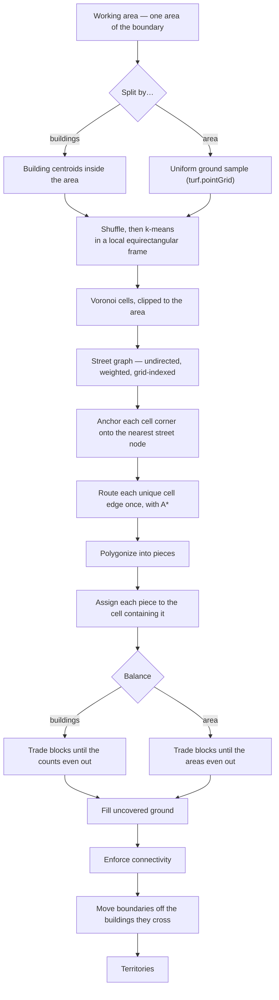

# OSM Territory Mapper

[Deutsch](#deutsch) · [Polski](#polski) · [Français](#français)

|    Territory clusters     |        Printing a territory card         |
|:-------------------------:|:----------------------------------------:|
|                           |                                          |
| **Using a card template** | **Searching to draw the territory area** |
|                           |                                          |

**Split a map area into walkable territories, then print each one as a PDF card.**

Draw a shape on a map — a neighborhood, village, or a few city blocks. The app downloads real streets and buildings from OpenStreetMap and splits the area into as many territories as you need. Every boundary follows **an actual street**, so instructions like "everything on this side of Railway Avenue" are ones people can actually use. Then print each territory as a PDF card, optionally fitted onto your own pre-printed template.

## Who it's for

Anyone who divides a geographic area into assignments for people on foot: canvassing, leaflet distribution, survey work, delivery rounds, parish visiting, and congregation field service. The primary audience is congregations of Jehovah's Witnesses carrying out their missionary work ([more about it](https://www.jw.org/finder?wtlocale=E&docid=502013361&srcid=share)).

## Quick start

1. **Draw the area** — select the polygon tool, click around the edges, double-click to close.
2. **Wait for data** — streets and buildings load from OpenStreetMap (a few seconds for a small town, longer for a city).
3. **Split it** — enter a number of territories ("40") or a target size ("~25 buildings each").
4. **Adjust by hand** — merge, cut, drag boundaries, or delete them. `Ctrl+Z` undoes any change.
5. **Add annotations** — write notes, drop pins on places, mark streets freehand or snapped to the road network, and place captions directly on the map.
6. **Print** — right-click a territory → Print. Choose line color and thickness, rotate or zoom, erase border segments, and export to PDF.
7. **Make a wall map** — import as many saved projects as you like into one (the Import dialog offers *Add* alongside *Replace* and accepts multiple files at once). Wall map then draws every territory from every project onto a single numbered sheet, up to A0.

Your work is saved in the browser automatically — a refresh or accidental tab close won't lose anything. Export to a file to open it later on another machine.

## What it is not

- Does **not** track who lives where, record visits, or store any information about residents.
- Does **not** make up street data — everything comes from OpenStreetMap. If a new housing estate is missing there, it's missing here too. Fix it in OSM, not here.

## Languages

Available in English, Polish, German, and French. Pick your language from the menu, or go directly to `/pl`, `/de`, or `/fr`.

## Setup

```bash
pip install .
osmapp
```

The Dockerfile does the same thing in three stages: Node vendors the client libraries, Python builds the wheel, and the final runtime image contains neither toolchain.

### Vendored client libraries

`static/vendor/` is checked into the repository — nothing fetches from a CDN at runtime. The folder is generated by `scripts/copy-vendor.js`:

```bash
npm install
npm run vendor
```

Run this after any `package.json` dependency bump and **commit the result**. The deploy workflow builds from a plain checkout with no Node step. On Renovate PRs, the CI workflow runs the vendor script automatically and folds the result into Renovate's own commit, so you only need to run it manually for bumps you make yourself. The script wipes `static/vendor/` before writing, so a package removed from `vendorConfig` leaves nothing behind. Paths under `static/vendor/` deliberately omit the version segment that CDN URLs include, which is why a version bump doesn't touch the `<script>` tags or `window.VENDOR` in `templates/index.html.j2`.

Each `src` in `vendorConfig` is one exact path with no fallback. At the end of the run, the script reads every `vendor/...` URL out of `templates/` and checks that each file actually exists. If a package moves its build output, the vendor step fails with a clear error rather than silently producing a file tree the page can't load. This check is also why the Dockerfile's vendor stage copies `src/osmapp/templates/` alongside `scripts/` — without the templates directory, the script crashes after it has already written the files.

pdf-lib, `@pdf-lib/fontkit`, and pdfjs-dist (~2 MB combined) are precached but only loaded when first needed, not at startup — so opening the app without ever touching the print dialog never parses them.

The same run writes `static/version.json` containing just the version from `package.json`. This file exists because `package.json` itself doesn't ship: a wheel contains only `src/osmapp/` and nothing above it, and the runtime image is built from that wheel with no Node present. `static/version.json` is how the server can report the version the browser is running. See the version banner section below.

### Configuration

All settings are optional and controlled through environment variables:

| Variable                  | Default                                         | Why you'd change it                                                                          |
|---------------------------|-------------------------------------------------|----------------------------------------------------------------------------------------------|
| `OSM_MAX_AREA_KM2`        | `50`                                            | Maximum area one Overpass request may cover. Larger areas are split into tiles of this size. |
| `OSM_MAX_TILES`           | `24`                                            | Maximum tiles per download. The real ceiling is this × `OSM_MAX_AREA_KM2`.                   |
| `OVERPASS_URL`            | `https://overpass-api.de/api`                   | Point to a mirror or your own Overpass instance.                                             |
| `OVERPASS_TIMEOUT`        | `180`                                           | Timeout in seconds. Only raise this alongside `OSM_MAX_AREA_KM2`.                            |
| `NOMINATIM_URL`           | `.../nominatim.openstreetmap.org/search`        | For self-hosted Nominatim — `/lookup` and `/reverse` are derived from this automatically.    |
| `GEOCODE_MIN_INTERVAL`    | `1.0`                                           | Minimum seconds between Nominatim requests. Lower only against your own instance.            |
| `BOUNDARY_THRESHOLD`      | `0.0001`                                        | Douglas-Peucker simplification in degrees (~11 m). Clients can request up to `0.01`.         |
| `TILE_URL`                | `https://tile.openstreetmap.de/{z}/{x}/{y}.png` | See [Tile usage](#tile-usage).                                                               |
| `TILE_CACHE_DIR`          | `.tile_cache`                                   | The Docker image points this to `/var/cache/osmapp/tiles`.                                   |
| `TILE_CACHE_MAX_MB`       | `500`                                           | Disk budget before pruning kicks in (aid tiles go first, then oldest OSM tiles).             |
| `TILE_CACHE_MAX_AGE_DAYS` | `60`                                            | Tiles older than this are removed regardless of the disk budget.                             |
| `IMAGERY_TILE_URL`        | Esri World Imagery                              | Satellite aid layer. Set to an empty string to remove it.                                    |
| `TERRAIN_TILE_URL`        | `https://tile.opentopomap.org/{z}/{x}/{y}.png`  | Terrain aid layer. Set to an empty string to remove it.                                      |
| `HOST` / `PORT`           | `0.0.0.0` / `5000`                              | Bind address.                                                                                |
| `FLASK_DEBUG`             | `0`                                             | Set to `1` to enable the Werkzeug debugger — never do this on a publicly reachable server.   |

Each aid layer also accepts `<NAME>_MAX_ZOOM` and `<NAME>_ATTRIBUTION` (e.g. `TERRAIN_MAX_ZOOM=17`).

### Basemaps

There is exactly one **printable** basemap: OpenStreetMap. A territory card is used in the field and must show street names and house numbers — aerial imagery doesn't have them, and topo maps show the wrong things. Cards are always rendered from OSM tiles regardless of what's currently visible on screen. This is not configurable.

**Aid layers** (satellite, terrain) are there for the planning side of the work: spotting building entrances, reading slopes, identifying private driveways. They appear in the layer switcher and are clearly marked as non-printable. Aid tiles share the disk cache but are evicted first — a session spent panning satellite imagery should never push out the basemap tiles needed for printing cards.

### Tile usage

Printing renders the basemap onto a canvas, so tiles pass through `/tiles/...` (same-origin for canvas access, with a custom User-Agent, and disk-cached). One card uses roughly 350 tiles per session — fine for occasional personal use. **If you print in volume, set `TILE_URL` to your own or a commercial tile source.** Attribution is embedded into every rendered image.

### Tests

```bash
pip install -e ".[test]"
playwright install chromium           # browser suite, optional
pytest
node --test "tests/js/*.test.mjs"     # no npm install needed
```

Tests focus on things that fail **silently and with real consequences** — obvious failures like 404 errors, startup crashes, or blank pages aren't worth the maintenance overhead. The JS suite uses Node's built-in test runner with no dependencies.

`tests/e2e/` is a deliberate exception to this principle: a blank page *is* obvious, but neither other suite can catch one. The server suite never renders the page, and the JS suite runs each module under Node with stubbed globals — so a missing `<script>` tag, an uncopied vendor file, or a module that throws on the real DOM passes both. The end-to-end suite starts the app on a temporary port, drives Chromium against it, and serves tiles and reverse-geocoding results itself — Overpass, Nominatim, and the tile provider are never contacted. **It skips itself gracefully, with an explanation, when `pytest-playwright` or the browser is missing** — a plain `pytest` run still executes everything else. `--browser firefox` and `--browser webkit` work the same way if a bug looks browser-specific.

`.github/workflows/ci.yml` runs all three suites on every push and pull request, and the Heroku deploy job requires all three to pass. Each suite emits JUnit XML that CI turns into a test summary with inline annotations. Fork PRs get a read-only token and see the raw log instead. A failed browser run uploads its Playwright traces, which let you replay the exact DOM, console output, and network activity from the failing run.

### Releasing

Push a `v*` tag. The vendor job rewrites the tag's version — `v1.4.2` becomes `1.4.2` — into `pyproject.toml` and `package.json`, regenerates `static/vendor/`, commits the result, and moves the tag onto that commit. The deploy job then builds from it. Both jobs run automatically on every tag with no manual steps. The version lives in the tag rather than on the branch, so `main` always keeps its placeholder. Moving the tag is a force-push made with `GITHUB_TOKEN`, which GitHub deliberately prevents from triggering another workflow run.

Both version numbers appear in the bottom-left corner of the page as `Server 1.4.2 · Client 1.4.2`. `internal/version.py` reads the server version from `pyproject.toml` (or from the installed package metadata), and the client version from `package.json` (or from `static/version.json`). Since both come from the same tag, they should always match — seeing them disagree is useful: it means either the image wasn't built from a release, or a service worker is still serving assets from a previous version. On mobile, the banner sits one row above the attribution line and steps aside when a tool bar is open on the map.

---

## Installing as an app

The app is a PWA — you can install it from the browser and use it offline for anything that doesn't require the server.

### What works offline

| Feature                                       | Offline? |
|-----------------------------------------------|:--------:|
| Open app, restore last session                |   yes    |
| Pan/zoom over previously viewed tiles         |   yes    |
| Draw, cut, merge, split, undo/redo            |   yes    |
| Write notes, drop pins, mark streets          |   yes    |
| Export GeoJSON                                |   yes    |
| Load template, print card, export PDF         |   yes    |
| Import a printed card back into a session     |   yes    |
| Fetch streets/buildings (Overpass)            |    no    |
| Search a place / suggest boundary (Nominatim) |    no    |

**The one catch is map tiles.** PDF composition works entirely offline, but the basemap underneath it doesn't — you get whatever tiles the service worker has cached from previous use. Pan over an area once while you're connected, and those tiles are available to print from anywhere.

### How updates work

No file under `static/js/` has a fingerprint in its name. Instead, the cache version is a SHA-256 hash computed over all precached files in `internal/pwa.py`, then embedded into `sw.js`. Change any asset → the worker's content changes → browsers detect it on the next navigation. No manual cache-busting is needed.

| Request                               | Strategy                 | Why                                                                                 |
|---------------------------------------|--------------------------|-------------------------------------------------------------------------------------|
| Navigation (`/`, `/pl`, `/de`, `/fr`) | Network-first            | HTML inlines the translation dictionary; a stale copy would show wrong text.        |
| `/static/**`                          | Cache-first              | Freshness is handled by the version hash.                                           |
| `/tiles/**`                           | Cache-first, capped 2000 | Tiles are immutable and already served with `max-age`.                              |
| `/tiles/aid/**`                       | Cache-first, capped 500  | Smaller budget, kept separate — aid tiles should never evict the printable basemap. |
| Everything else                       | Network-only             | Overpass and Nominatim require a live server.                                       |

**Updates are never silent.** When a new service worker is ready, it waits and the page offers you a reload prompt. The undo stack lives in memory and isn't part of the saved session, so activating a new worker mid-edit would discard it.

**Service worker registration doesn't block startup.** It waits for the `load` event to avoid competing with the first Overpass request. But the startup sequence runs from a timer after `DOMContentLoaded` and reaches `pwa.js` last — by which point, on any visit after the first (when all assets are already in the HTTP cache), the page has finished loading. `pwa.js` checks `document.readyState` and registers immediately in that case. If the worker never registers, nothing on screen reports it — the app is already running from memory. The first thing that will actually break is printing a card without a connection, because DejaVuSans is fetched when a PDF is built, not when the page loads.

### Deliberately not done: bulk tile pre-fetching

A "download this territory for offline use" button is the obvious next feature, but the OSM tile usage policy forbids bulk downloading. Tiles you actually view get cached as a byproduct of normal use; systematically fetching every tile in a bounding box at every zoom level is not allowed. If you point `TILE_URL` at your own or a commercial tile source, bulk pre-fetching becomes reasonable — the caching infrastructure is already in place.

---

## Project layout

```text
src/osmapp/internal/*.py    Flask: Overpass proxy, geocoding, tiles, PWA manifest
templates/index.html.j2     Page shell + UI markup as <template> elements
templates/sw.js.j2          Service worker, rendered by internal/pwa.py
static/css/style.css        All styling; design tokens at top
static/lang/{en,pl,de,fr}.json
static/js/                  One IIFE module per file, namespaced under window.App
static/fonts/               DejaVuSans, embedded into cards by pdfdoc.js
static/icons/               PWA icons (SVG + generated PNGs)
static/vendor/              Leaflet, Turf, pdf-lib, pdf.js — no CDN at runtime
static/version.json         Client version, written by copy-vendor.js
scripts/copy-vendor.js      Populates static/vendor/ from node_modules
tests/                      pytest (server), node --test (client)
tests/e2e/                  pytest + Playwright (the page in a real browser)
```

### Modules

No bundler, no ES module imports — just `<script>` tags and a shared `window.App` namespace. Load order is fixed in `index.html.j2` and verified by a test (any file in `static/js/` that isn't in the list gets precached and shipped, but never runs).

| Module          | Responsibility                                                 |
|-----------------|----------------------------------------------------------------|
| `util`          | localStorage that survives private mode, OSM tag normalization |
| `i18n`          | Dictionary loading, `t()`, DOM subtree translation             |
| `state`         | The single mutable store — everything reads `App.state`        |
| `store`         | IndexedDB key/value — session and uploaded template            |
| `dom`           | Clones `<template>` elements, looks up nodes by `data-role`    |
| `shortcuts`     | One keydown dispatcher; `?`/F1 sheet built from its registry   |
| `vertices`      | Polygon corner handles, hold-to-erase gesture                  |
| `basemap`       | Printable OSM layer, optional aid layers, the print rule       |
| `geometry`      | Turf wrappers, polygon normalization, planar segment noding    |
| `spatial`       | Uniform grid index, fast planar distance, binary min-heap      |
| `coverage`      | Boolean raster over a lng/lat box and its rings                |
| `network`       | The street graph, shared by everything that follows one        |
| `ui`            | Loading overlay, info panel, context menu, dialogs             |
| `polygons`      | Territory lifecycle, hover info, filtered street/building view |
| `labels`        | Numbered chips on parts sharing a territory number             |
| `naming`        | Territory names, from OSM data and from what cards said        |
| `pdfdoc`        | Reads/writes PDFs: template measuring, preview, composition    |
| `data`          | Overpass fetching, rendering, export/import, merging projects  |
| `session`       | Debounced save and restore of working state                    |
| `clustering`    | K-Means → Voronoi → street-routed boundaries                   |
| `balance`       | Trades blocks between territories until they even out          |
| `editing`       | Cut lines, merging, cleanup                                    |
| `trim`          | Shrinks the outer boundary down to the buildings that matter   |
| `outline`       | Reshapes the outer boundary after it's been set                |
| `gaps`          | Parts of the area that don't belong to any territory           |
| `footprints`    | Boundaries that cross buildings, moved off them                |
| `autoheal`      | Fixes the problems the territory list can identify             |
| `notes`         | Annotations: notes, pins, marks, captions                      |
| `print-filters` | Basemap filters for the print preview                          |
| `print`         | Canvas map rendering, framing, eraser, card and wall-map sheet |
| `boundary`      | Turns a geocoder result into the outer polygon                 |
| `history`       | Undo/redo                                                      |
| `controls`      | Toolbar, language picker, reset                                |
| `demo`          | Sample territory for the guided tour                           |
| `tour`          | First-run walkthrough                                          |
| `pwa`           | Worker registration, update prompt, online badge               |
| `main`          | Boot sequence and map wiring                                   |

---

## How the pieces work

### Splitting into territories

Two split modes are available, and they optimize for different things. **By building count** gives each territory roughly the same number of houses. **By territory count** gives each territory roughly the same area of ground. Both use the same pipeline and differ in exactly two places: what k-means is seeded with, and what the balance pass evens out. Everything in between is the same.



Every phase yields to the event loop, so the UI stays responsive and the run can be cancelled.

#### Choosing *k*

Splitting by territory count takes *k* directly. Splitting by building count takes *n* (the desired number of houses per territory) and derives:

$$k = \max\left(2,\ \left\lceil \frac{N}{n} \right\rceil\right),\qquad k \leftarrow \min(k,\ 200)$$

where *N* counts the buildings **inside the area being split** — not the entire download. On a boundary containing three villages, using the full download count would size *k* for all three, while the run only divides one of them. The 200-territory ceiling is applied before the dialog shows its estimate, so you see "200 territories, about 60 buildings each" up front rather than discovering it afterwards.

#### Phase 0 — what gets clustered

Splitting by buildings clusters the building centroids. Splitting by area clusters a uniform sample of the ground itself, generated by `turf.pointGrid` at a spacing derived from the area:

$$s = \sqrt{\frac{A}{25\,k}}$$

This ensures both a hamlet and a city get around 25 sample points per territory, rather than using a fixed grid that would be too coarse for one and overwhelming for the other.

The distinction matters because k-means only converges on equal-area cells when its input points are spread evenly over the area. In a village with three dense clusters and scattered outlying farms, seeding with buildings versus seeding with ground produces very different Voronoi cell sizes:

| Seeded with   | Smallest cell | Largest cell | Ratio    |
|---------------|---------------|--------------|----------|
| buildings     | 6 900 m²      | 1 439 900 m² | **208×** |
| ground sample | 244 900 m²    | 638 600 m²   | **2.6×** |

Both against an ideal of 470 300 m². Splitting by area is only meaningful with the second approach.

#### Phase 1 — k-means

Points are scaled into a local equirectangular frame before clustering, then scaled back:

$$x' = x \cos\varphi_0$$

`turf.clustersKmeans` measures Euclidean distance on raw degrees, but a degree of longitude is only $\cos\varphi$ as long as a degree of latitude — 0.61 at 52° N — so clustering unprojected coordinates produces territories that are systematically stretched north-south.

Lloyd's algorithm then minimizes the within-cluster sum of squares:

$$\arg\min_{S}\ \sum_{i=1}^{k}\ \sum_{x \in S_i} \lVert x - \mu_i \rVert^2 ,\qquad \mu_i = \frac{1}{|S_i|}\sum_{x\in S_i} x$$

Two things about this are worth knowing, because both look like bugs and only one actually is.

**The seeding is a bug, and it's turf's.** `clustersKmeans` seeds with `coordAll(points).slice(0, k)` — the first *k* features in array order, not a representative sample and not k-means++. Overpass returns buildings in OSM ID order, and IDs run in contiguous blocks per import, so all *k* seeds land in one corner of the map. Lloyd's algorithm can't move a centroid across a town it has no points in. The fix is to shuffle the input first, deterministically (xorshift32 with a fixed seed), which turns that slice back into the uniform sample the algorithm expects. On 3,000 buildings at *k* = 150:

| Seeding              | Median territory | Largest territory |
|----------------------|------------------|-------------------|
| input order (turf's) | 4 buildings      | 434 buildings     |
| shuffled             | 20 buildings     | 53 buildings      |
| k-means++            | 6 buildings      | 74 buildings      |

Plain shuffled sampling beats k-means++ here, and not by coincidence: k-means++ spreads seeds by distance, which deliberately over-serves empty outskirts, while sampling proportional to density is exactly what count-balancing needs.

**The remaining imbalance is not a bug.** For a point density $f$, the asymptotically optimal quantizer places centroids at density:

$$\lambda \propto f^{\frac{d}{d+2}} \;\overset{d=2}{=}\; \sqrt{f}$$

So the number of points assigned to one centroid scales as $f/\sqrt{f} = \sqrt{f}$. A neighborhood nine times denser than the outskirts will produce territories with three times as many houses — and that's the *correct converged answer*. No amount of additional iterations will fix it. Equalizing the counts is a separate job, handled in phase 5.

#### Phase 2 — Voronoi

The centroids are deduplicated and their Voronoi diagram is clipped to the area. Each surviving cell records which centroid owns it, so phase 5 can assign pieces by containment rather than by proximity — street-routed boundaries deviate far enough from the Voronoi edges that nearest-centroid alone can place pieces inside the wrong territory's body.

#### Phases 3 and 4 — putting the boundary on a street

The street graph is undirected and weighted by length, with a uniform grid index for nearest-node lookups.

Cell corners are handled first. A Voronoi vertex falls wherever three cells happen to meet — usually in the middle of a block. Routing *from* that vertex means the boundary starts with a straight line from the vertex to the first street node, creating a territory edge that runs along a road and then cuts between two houses to reach a corner in someone's garden. Instead, each corner is snapped to the nearest street node within 60 m (roughly half a block), and routing runs between corners that are already on the network. On a sparse test case — 150 m blocks with a fifth of links missing — 96% of corners land on a street, and 91% of off-street boundary length disappears.

The snap is memoized per corner at five decimal places, roughly one metre. Three cells meet at each corner and each contributes its own copy; if they disagree on where it snapped, their rings don't close and `turf.polygonize` returns fewer faces than there are territories. Corners on the outer boundary are never moved — those are where a territory meets the edge of the overall area.

Each unique cell edge is then routed once, keyed on its sorted endpoint pair. Routing both cells' copies independently could let A\* return two different paths for the same edge, which breaks the planar graph. The search minimizes:

$$w(u,v) = d(u,v)\left(1 + 0.3\,\frac{\Delta\theta}{90^{\circ}}\right)$$

where $\Delta\theta$ is the angle between that step and the bearing of the straight Voronoi edge. The penalty is enough to prefer a road running alongside the edge over an equally short detour at right angles to it, but not enough to reject a genuine dogleg. The search stops after 5,000 pops so a partition can't stall when two endpoints are in disconnected components.

#### Phase 5 — pieces, balance, repair

The routed lines are noded and polygonized into pieces. Each piece is assigned to the territory whose Voronoi cell contains its interior point, falling back to the nearest centroid.

Nothing up to this point has measured the finished territories, so the balance pass does. It works on the pieces rather than merged outlines — a block is only tradeable while it's still a block — and hill-climbs on the total deviation from the target:

$$C = \sum_i \left| L_i - \bar{L} \right| ,\qquad \bar{L} = \frac{1}{n}\sum_i L_i$$

$L_i$ is building count in one mode and square metres in the other; the trade logic doesn't care which. A block moves from territory $A$ to adjacent territory $B$ only if the move strictly reduces $C$, so the cost falls monotonically and the loop can't cycle. Two rules outrank balance: a territory never gives away its last block, and never gives away a block that would split it into more pieces than it already was.

Adjacency between pieces is determined from shared edge coordinates, not from buffered intersection tests. `turf.polygonize` builds faces from the noded line set it was given, and that set is rounded to five decimal places first — so two faces sharing an edge carry the exact same coordinates for it. The adjacency answer is already in the geometry.

Three repairs follow, in this order and for these reasons:

1. **Fill uncovered ground.** Any ground inside the outer area but not in any territory gets merged into a territory it actually touches, ranked by shared boundary length rather than centroid distance.
2. **Enforce connectivity.** Any territory in more than one piece keeps its largest piece and hands each orphan to the neighbor sharing the most boundary with it. An orphan that touches nothing becomes its own territory; one that is both tiny and empty is dropped — but only if empty, since a house on dropped ground would get no card.
3. **Move boundaries off buildings.** Where routing failed and the straight Voronoi line survived, it may pass through a building. The whole footprint goes to whichever territory already holds most of it. This step runs last because the two passes above weld shapes with a half-metre grow/shrink that would round an outline already sitting on a wall.

The run then reports what it produced — `buildings 14–26 (avg 20.0)`, or the equivalent in m² — measured on the finished territories rather than carried forward from the balance pass, since all three repair steps move ground after it.

### Merging

`geometry.unionHealed()` expands each input by 0.5 m before unioning, then shrinks back. A plain `turf.union` on nearly-coincident boundaries returns a MultiPolygon of touching pieces with visible internal outlines; the expand/shrink closes sub-metre gaps so the union genuinely dissolves them.

### Areas: a project made of several boundaries

A project drawn in one session has one outer boundary. A project assembled from imports has one boundary per import — disjoint and often kilometres apart — making the boundary a **MultiPolygon**. Two distinct questions arise from this, and the code keeps them separate deliberately:

- **"Inside the boundary"** — coverage, gaps, clipping a hand-drawn territory, what a wall map frames, what a download covers. This always means the whole boundary: `geometry.outerFeature()`.
- **"Which specific area"** — reshaping an outline, trimming it to its buildings, splitting it into territories. Each of these operates on one place and walks a single ring. This is `polygons.workingOuter()`, which picks the area holding the selected territory, then the area at the center of the screen, then the largest. No separate control is needed because every one of those tools places its handles, preview, or result on the area it selected.

`polygons.replaceOuterPart()` puts an edited area back by subtracting the old shape and unioning in the new one, leaving untouched areas unchanged. Downloads run one area at a time — the server accepts a single polygon and enforces a size limit. A single request covering the bounding box of three villages would pull in the farmland between them.

Merging two projects appends territories minus any ground already covered (non-overlapping territories is the invariant that building counts, the gap finder, and printed marks all depend on), deduplicates streets and buildings by OSM ID, and appends notes. See the block comment in `data.js`.

### Printing

The card is **rendered from scratch onto a canvas** — not screenshotted from Leaflet. This guarantees that only the target territory's outlines are drawn (no stray borders) and renders at 300 dpi regardless of window size.

Three layers compose the result:

- **tiles** — basemap + attribution, never erasable
- **border** — the territory outline on a transparent layer; erased segments use `destination-out` to remove the line while leaving the map underneath
- **preview** — tiles + border at the chosen opacity

The canvas is locked to the template placeholder's aspect ratio, so cropping means choosing which slice of the map lands on it. Drag to pan, scroll or pinch to zoom, use buttons for quarter turns.

A **wall map** uses the same dialog and the same three layers, but receives every territory instead of one. It differs in three ways: the subject is a `FeatureCollection` (which `polygonParts` flattens the same way it handles a territory split by a cut, so framing and drawing need no special cases); there's no template, so the sheet is an ISO A size with a margin and a heading band; and nothing is marked as printed afterwards, because a poster of forty territories is not the same as forty individual cards. Territory number chips are drawn on the furniture layer alongside the scale bar and compass — not on the border — so neither the border opacity slider nor the eraser affects them.

What a chip displays is **the label the card gave that territory**, falling back to the session index number. Session numbers are just positions in the list, not names — congregations have their own ("S-13", "12a"), which they type into the card's *Territory no.* field. That value is now stored on the territory itself (`properties.label`, alongside the printed mark), so it carries through into the wall map, into the next card's suggested label, and into exports. Chips are pill-shaped rather than round discs so that a single digit still looks round.

Resolution is not fixed at 300 dpi. An A0 sheet at 300 dpi is 140 megapixels, which no browser will allocate — and rather than refusing, browsers silently return a blank canvas. So `PX_PER_PT` is calculated per sheet from the sheet dimensions and a pixel area ceiling, and everything measured in points multiplies by it rather than by a fixed `DPI` constant.

Key implementation details: tiles are fetched **once** per session (at one zoom level, cached as decoded `Image` objects for the dialog's lifetime — some softness at higher zoom is the trade-off). Erase strokes are stored in **lng/lat coordinates with width in metres**, not pixels, so panning after erasing doesn't shift erasures away from what they were covering.

### Composition

`pdfdoc.js` handles everything that touches a PDF, using pdf-lib (for writing) and pdf.js (for reading), both loaded on first use:

1. **Measuring the template** — locates the placeholder rectangle and field positions by walking the content stream (including Form XObjects). The result is cached per template using SHA-256; the placement dialog allows manual correction.
2. **Rasterizing a page** at 110 dpi on white — PDF pages have no background color, and a card rendered on transparency would appear as a solid black rectangle in dark mode.
3. **Stamping the map** and filling in locality/territory fields using DejaVuSans (subsetted to only the glyphs actually used — the standard 14 PDF fonts don't include `ł ą ę ś ż ź ć ń`).
4. **Embedding the project** — gzipped JSON stored as a named attachment, so a printed card is also a restore point. This is why `.pdf` appears in the import dialog's accepted file types.

None of this requires the server: a template file never leaves the machine it was opened on.

### Notes

Annotations are stored separately from territories: a note survives re-partitioning, can sit outside the boundary, and can be toggled on and off without touching any geometry. There are four kinds, all sharing one record format — `{ kind, points, text, color, width }` — where a mark has multiple points and everything else has one:

| Kind    | What it is                  | How it appears on the map                                                |
|---------|-----------------------------|--------------------------------------------------------------------------|
| note    | a sentence pinned to a spot | sticky-note glyph, text always visible                                   |
| pin     | a place or building         | teardrop shape, tip on the spot, text shown on hover                     |
| mark    | a stroke along the ground   | a line, drawn freehand or snapped to streets, with handles on each point |
| caption | text only                   | just the words, no glyph                                                 |

Marks come from one tool and the gesture determines the type: dragging creates a freehand stroke, clicking places a vertex. With **Snap to streets** on, a clicked vertex snaps to the road network and the segment before it is routed along the road — using the same detour limits as the cut tool — so "this street, not the next one" is a mark that actually lies on the street. **Freeform** is the opposite: only the drag gesture draws, a click does nothing, and snapping is automatically disabled because a freehand sweep has no vertices to snap. Every annotation type prompts for text when created — a note without text is discarded, while a pin or mark is kept either way. Notes are included in the session, GeoJSON export, and card attachment.

**A line being drawn can be stepped back, not just cancelled.** While a line is open, `Ctrl+Z` and `Backspace` undo the last action — a clicked point, or a complete freehand sweep (since half a sweep is just a start point with nothing attached) — and `Ctrl+Y` puts it back. This works even past the first point: the line disappears from the map but its steps are still remembered, so one `Ctrl+Z` too many costs nothing. Undo returns to affecting the note list once the line is saved or dismissed with `Esc`.

**A mark stores its skeleton so it can be edited.** Alongside the geometry that everything downstream renders, a mark stores the points the user placed and what the app did between each pair — `{ at, snapped, via, bend, sweep }` per node, where `via` is the path a segment follows (a routed street path or freehand samples), `bend` is the control point of a curve, and neither is a straight line. The geometry is always derived from this skeleton and never read back from a saved file, so edits and reloads always agree.

While the pencil tool is active, every mark shows the same handles as the polygon editor — the same shape for the same gesture:

| Handle                       | Gesture | What happens                                                                                                 |
|------------------------------|---------|--------------------------------------------------------------------------------------------------------------|
| point                        | drag    | the point moves, and its two adjacent segments are recalculated — re-snapped and re-routed if snapping is on |
| point                        | click   | the point is removed (down to the minimum of two)                                                            |
| middle of a straight segment | drag    | the segment bends into a curve passing through the handle                                                    |
| middle of a bent segment     | click   | the bend is removed and the segment becomes straight again                                                   |

The endpoints of a freehand segment have no handles: that segment is a series of samples of where your hand moved, and moving one end would leave the rest behind. Marks drawn before this editing feature existed also have no handles — there's no skeleton in the file, so the mark renders from its stored geometry as it always did.

**Both output formats show the same content.** A PNG is a flat image, so everything is drawn into it. A PDF is a document, so the same marks are drawn *and* also stored as real PDF annotations — one per note, making the glyph and its text a single object you can open, move, or delete:

| Kind            | In a PDF                                                                  |
|-----------------|---------------------------------------------------------------------------|
| note, pin, mark | `/Ink` — the glyph or stroke, with the text in the same appearance stream |
| caption         | `/FreeText` — the annotation type a reader opens for direct editing       |

`/Ink` is used rather than the sticky-note `/Text` that a pin might more naturally suggest, because popup notes can't be selected and deleted in most readers — and a pin you can't remove is worse than one filed under the technically wrong type.

Each annotation carries its own appearance stream and the print flag, so a card looks identical in every PDF viewer rather than being drawn however that viewer renders comments. The annotation also carries all the metadata a comment list reads: `/T`, `/Contents`, `/M`, `/CreationDate`, `/Subj`, and a linked `/Popup`. `print.js` builds the glyph outlines and text boxes, then passes everything to `pdfdoc.js` as fractions of the map image — so one part of the app knows what a pin looks like, and one knows where the map sits on the page. Each text box is measured twice — once with Arial (for the preview) and once with DejaVu (for the card) — and kept at whichever is wider, since a box sized for the narrower font clips the last word off every label.

Captions are drawn in the pen color, matching how they appear on the map. Mark labels stay black inside their boxes — black being the color that survives printing over a street map. Both are written so that a reader which rebuilds the appearance itself ends up in the same place: the text color lives in `/DA` — on a `/FreeText`, that's where the lettering color is set, while `/C` controls what's painted *behind* it. The intended subtype is `/FreeTextTypeWriter` (words with no box), and the font is named in the document's form resources, because that's where `/DA` is resolved (PDF 32000-1 §12.7.3.3). Without it, a re-typed caption comes back in a substituted font with Polish diacritics stripped.

**"Draw the words on the card"** hides text boxes for a crowded card: glyphs and strokes remain, but text goes only into the PDF's comment layer. Captions are nothing but text, so they're drawn regardless. The switch is unavailable when annotations are hidden entirely, since there would be nothing to draw.

---

## Translations

Markup is annotated declaratively:

```html
<span data-i18n="menu.print">Print</span>
<a data-i18n-attrs="title=toolbar.draw;aria-label=toolbar.draw"></a>
```

`App.dom.render()` translates every cloned template when it's mounted. Strings built in JavaScript go through `T("key", { count: 3 })`; `{placeholders}` are interpolated and numbers are formatted via `Intl.NumberFormat`. The language is determined by the URL; Flask inlines the matching dictionary along with an English fallback, so there's no extra network request and no flash of untranslated text on first load. Console output stays in English — it's developer output, and translating it makes bug reports harder to read.

**Adding a language:** copy `static/lang/en.json`, translate it, add `{ code, label }` to `LANGUAGES` in `static/js/i18n.js` and to `SUPPORTED_LANGS` in `internal/i18n.py`. The language picker, `/<lang>` routes, and dictionary parity test all pick it up automatically.

---

## HTTP API

| Route                                     | Purpose                                                     |
|-------------------------------------------|-------------------------------------------------------------|
| `GET /`, `/pl`, `/de`, `/fr`              | The app (`/en` redirects to `/`)                            |
| `POST /split_area`                        | GeoJSON polygon in → the sub-areas to download, in order    |
| `POST /fetch_streets`                     | GeoJSON polygon in → drivable street network out            |
| `POST /fetch_buildings`                   | GeoJSON polygon in → building footprints with addresses out |
| `GET /geocode?q=`                         | Nominatim proxy, cached and rate-limited to 1 req/s         |
| `GET /geocode_boundary?osm_type=&osm_id=` | Resolves one relation or way to a simplified polygon        |
| `GET /reverse_geocode?lat=&lon=`          | Returns locality candidates for a point (used for naming)   |
| `GET /tiles/<z>/<x>/<y>.png`              | Tile proxy with disk cache — printable basemap              |
| `GET /tiles/aid/<layer>/<z>/<x>/<y>.png`  | Same proxy for on-screen aid layers. Never printed.         |
| `GET /sw.js`, `/manifest.webmanifest`     | Service worker and web app manifest, per language           |
| `GET /service/health`                     | Returns `OK` — used by the deploy health check              |

Both fetch endpoints require the full polygon on **every** request. There is deliberately no server-side geometry cache — a module-level cache caused two browser tabs (or any multi-worker deployment) to receive each other's data.

`/split_area` is what makes large areas downloadable. One Overpass request covers at most `OSM_MAX_AREA_KM2` km²; anything larger is cut into a grid, each cell clipped to the boundary, and the client fetches the pieces in sequence and assembles them. The split happens server-side because the size limit is enforced there: the browser measures a polygon on the sphere and the server measures it on a flat projection, and the difference is large enough for a tile valid in one to be rejected by the other. Grid cells come back tagged, and tagged cells are fetched differently — data crossing their edges is kept rather than cut, since a grid line isn't a boundary anyone drew. A polygon that's already small enough comes back as a single untagged tile, the same as a download always worked before.

---

## Keyboard shortcuts

| Key                                     | Action                                                               |
|-----------------------------------------|----------------------------------------------------------------------|
| `?` or `F1`                             | Shortcut reference (works inside dialogs too)                        |
| `Ctrl/Cmd + Z`                          | Undo (territory geometry, a mark being drawn, or the print eraser)   |
| `Ctrl/Cmd + Y` / `Ctrl/Cmd + Shift + Z` | Redo                                                                 |
| `Enter`                                 | Confirm the current modal tool (cut, merge, trim, outline, draw)     |
| `Esc`                                   | Cancel drawing or a modal tool, or close a dialog                    |
| `Alt` (held while cutting)              | Place a free vertex instead of snapping to a street                  |
| `A`                                     | Notes tool; `1`–`4` pick the pen; `S` toggles snapping, `F` freeform |
| `W`                                     | Wall map — all territories on one sheet                              |
| Right-click                             | Context menu — on a territory, empty ground, or the boundary         |

All key bindings are registered in one place in `shortcuts.js`, which also generates the `?` reference sheet from that same registry.

---

## Known limits

- **The session is not a backup.** It's stored in IndexedDB for that browser origin — it survives a refresh, crash, or reboot, but clearing site data wipes it, and another machine has never seen it. Export to GeoJSON or print a card with the project embedded to make a real backup.
- **The partitioner is tuned for urban areas.** Rural areas fall back to street/boundary sampling and produce coarser results.
- **Only single-page rectangular placeholders are supported.** Multi-page or rotated placeholders require changes to `PLACEHOLDER` in `print.js` and `compose` in `pdfdoc.js`.
- **A multi-area project opens as a single area on older builds.** The boundary is stored as a MultiPolygon in the same `outerPolygon` field a single area has always used, so the file format hasn't changed and all existing sessions and exports still load. An older build reads that field with `largestPolygon()` and silently keeps only the largest area. The version gate was deliberately not raised — doing so would reject every existing session and export.
- **Wall maps above A3 print below 300 dpi.** The canvas is capped at twenty megapixels, which works out to about 115 dpi across an A0 sheet. Raising `MAX_RENDER_PX` multiplies memory use by three (the preview, border, and tile mosaic are all held at that size), and a browser that can't allocate it returns a blank canvas rather than an error.
- **Offline printing uses only cached tiles.** Areas you haven't visited yet come out blank — this is visible in the preview before you export.
- **Server error messages are always in English** regardless of the interface language. To fix this, return error *codes* from the server and map them to `alert.*` keys on the client side.
- **Note labels don't avoid each other.** Each label is placed next to its own mark wherever it lands, so two notes at the same corner will overlap. The "Draw the words on the card" switch is the workaround for cards where this is a problem.
- **PDF annotation visibility depends on the reader.** Notes live in the PDF's annotation layer, which is what makes them openable and deletable — but a reader configured to hide or not print comments will suppress them. They carry the print flag, so printing includes them by default; a reader that ignores the flag is overriding it intentionally. To flatten annotations permanently into the page: `qpdf --flatten-annotations=all`.

---

## Attribution

Map data © OpenStreetMap contributors, available under the [Open Database License](https://www.openstreetmap.org/copyright). Attribution is embedded into every printed map. Geocoding uses Nominatim; routing data and building footprints come from Overpass. Please review those services' usage policies before deploying this anywhere shared.

---
---

## Deutsch

Teilt einen Kartenbereich in begehbare Gebiete auf und druckt jedes einzelne als
Karte aus.

### So funktioniert es

Ihr zeichnet eine Form auf einer Karte ein – ein Stadtviertel, ein Dorf, ein paar
Häuserblocks. Die App lädt die tatsächlichen Straßen und Gebäude aus OpenStreetMap
und teilt die Form in so viele Teile auf, wie ihr wünscht. Jede Grenze verläuft
*entlang* einer Straße, sodass „alles auf dieser Seite der Bahnstraße" eine
Anweisung ist, nach der man handeln kann. Dann druckst du: Jedes Gebiet wird zu
einer PDF-Karte, die nur dieses Gebiet zeigt, mit der Grenze darüber. Du kannst
sie auf ein vorgedrucktes Formular ziehen, sodass die Karte in das dafür
vorgesehene Feld passt.

### Für wen ist es gedacht

Jeder, der ein geografisches Gebiet in Aufgabenbereiche unterteilt und an Personen
vor Ort verteilt: Gemeindedienst, Wahlwerbung, Flugblattverteilung, Umfragen,
Gemeindebesuche, Auslieferungsrunden. Die Hauptzielgruppe sind Gemeinden der
Zeugen Jehovas ([mehr dazu](https://www.jw.org/finder?wtlocale=X&docid=502013361&srcid=share)).

### Was du konkret tust

1. **Gebiet einzeichnen** — Polygon-Werkzeug, entlang der Ränder klicken,
   Doppelklick zum Schließen.
2. **Daten warten** — Straßen und Gebäude werden aus OSM geladen.
3. **Aufteilen** — Anzahl Gebiete („40") oder Zielgröße („~25 Gebäude") wählen.
4. **Anpassen** — Gebiete zusammenfügen, aufteilen, Grenzen verschieben, löschen.
   `Strg+Z` macht rückgängig.
5. **Anmerken** — Notizen schreiben, Nadeln auf Orte setzen, Straßen freihand
   oder am Straßennetz eingerastet markieren, Beschriftungen auf die Karte
   setzen.
6. **Drucken** — Rechtsklick auf ein Gebiet → „Drucken". Linienfarbe/-stärke
   festlegen, Karte drehen/zoomen, Umrandungsteile löschen, PDF exportieren.
   Auf einer PDF-Karte werden die Anmerkungen zu echten Kommentaren, auf einem
   PNG in die Karte gezeichnet.
7. **Alles auf eine Wandkarte** — beliebig viele gespeicherte Projekte in eines
   importieren (Import bietet „Hinzufügen" neben „Ersetzen" und nimmt mehrere
   Dateien auf einmal), dann zeichnet „Wandkarte" alle Gebiete nummeriert auf
   ein einziges Blatt, bis zu A0.

Deine Arbeit wird im Browser gespeichert. Exportiere alles in eine Datei, um sie
später auf einem anderen Rechner zu laden.

### Was es nicht ist

Es weiß nicht, wer wo wohnt, verfolgt keine Besuche und speichert keine Einwohnerdaten.
Es zeichnet Grenzen und druckt Karten. Auch Straßendaten werden nicht erfunden —
alles stammt aus OpenStreetMap; was dort fehlt, fehlt auch hier. Korrekturen werden
auf OSM vorgenommen, nicht hier.

### Sprache

Verfügbar auf Englisch, Polnisch, Deutsch und Französisch. Wähle aus dem Menü oder
gehe zu `/pl`, `/de` oder `/fr`.

---

## Polski

Podziel obszar mapy na terytoria piesze, a następnie wydrukuj każde jako kartę
PDF.

### Jak to działa

Rysujesz na mapie kształt — dzielnicę, wieś, kilka przecznic. Aplikacja pobiera
z OpenStreetMap rzeczywiste ulice i budynki, a następnie dzieli ten kształt na
tyle części, ile zlecisz. Każda granica przebiega *wzdłuż* drogi, więc „wszystko
po tej stronie Kolejowej" to wskazówka, którą można wykorzystać w praktyce.
Następnie drukujesz: każdy obszar staje się kartą PDF pokazującą tylko ten
obszar, z narysowaną granicą. Możesz umieścić ją na wcześniej wydrukowanym
szablonie.

### Dla kogo to jest

Każdy, kto dzieli obszar geograficzny na zadania i przydziela je osobom pieszo:
służba terenowa, akcje informacyjne, rozdawanie ulotek, ankiety, wizyty
parafialne, trasy dostawcze. Główną grupą docelową są zbory Świadków Jehowy
([więcej](https://www.jw.org/finder?wtlocale=P&docid=502013361&srcid=share)).

### Co faktycznie robisz

1. **Narysuj obszar** — narzędzie wielokąta, klikaj wzdłuż krawędzi, dwukrotnie
   kliknij, aby zamknąć.
2. **Poczekaj na dane** — ulice i budynki z OSM.
3. **Podziel obszar** — liczba terytoriów („40") lub wielkość („~25 budynków").
4. **Dopasuj ręcznie** — połącz, podziel, przeciągnij granice, usuń. `Ctrl+Z`
   cofa.
5. **Dodaj notatki** — pisz notatki, wstawiaj pinezki, zaznaczaj ulice
   odręcznie lub z przyciąganiem do sieci dróg, dodawaj podpisy na mapie.
6. **Wydrukuj** — prawy przycisk na obszar → „Drukuj". Ustaw linię,
   obróć/zoomuj, usuń fragmenty obramowania, eksportuj PDF. Na karcie PDF
   notatki stają się prawdziwymi komentarzami, na PNG są rysowane na mapie.
7. **Wszystko na jednej mapie ściennej** — zaimportuj do jednego projektu
   dowolnie wiele zapisanych („Import" proponuje „Dodaj" obok „Zastąp"
   i przyjmuje kilka plików naraz), a „Mapa ścienna" narysuje wszystkie tereny
   z numerami na jednym arkuszu, nawet A0.

Praca jest zapisywana w przeglądarce. Eksportuj do pliku, aby załadować później
na innym komputerze.

### Czym to nie jest

Narzędzie nie wie, kto gdzie mieszka, nie śledzi wizyt, nie przechowuje danych
mieszkańców. Wyznacza granice i drukuje mapy. Dane ulic pochodzą z OSM — czego
tam nie ma, nie ma też tutaj. Poprawki na OSM, nie tutaj.

### Język

Dostępne w języku angielskim, polskim, niemieckim i francuskim. Wybierz z menu
lub przejdź do `/pl`, `/de`, `/fr`.

---

## Français

Divisez une zone de la carte en territoires parcourables à pied, puis imprimez
chacun sous forme de carte PDF.

### Fonctionnement

Vous tracez une forme sur la carte — un quartier, un village, quelques pâtés de
maisons. L'application télécharge les rues et bâtiments réels depuis OpenStreetMap,
puis découpe la forme en autant de morceaux que vous le souhaitez. Chaque limite
longe *une* route, de sorte que « tout ce qui se trouve de ce côté de l'avenue
Railway » est une instruction que vous pouvez suivre. Il ne vous reste plus qu'à
imprimer : chaque territoire devient une fiche PDF présentant uniquement ce
territoire, avec la limite tracée par-dessus. Vous pouvez les glisser sur un
formulaire pré-imprimé.

### À qui s'adresse cet outil

À toute personne qui divise une zone géographique en secteurs d'intervention
attribués à des personnes à pied : service de terrain, porte-à-porte, distribution
de tracts, enquêtes, visites paroissiales, tournées de livraison. Le public cible
principal est constitué des congrégations des Témoins de Jéhovah
([en savoir plus](https://www.jw.org/finder?wtlocale=F&docid=502013361&srcid=share)).

### Comment procéder

1. **Dessinez la zone** — outil polygone, cliquez autour du périmètre,
   double-cliquez pour fermer.
2. **Attendez les données** — rues et bâtiments depuis OSM.
3. **Divisez** — nombre de secteurs (« 40 ») ou taille cible (« ~25 bâtiments »).
4. **Ajustez manuellement** — fusionnez, réduisez, déplacez une limite, supprimez.
   `Ctrl+Z` annule.
5. **Annotez** — écrivez des notes, posez des épingles, marquez des rues à main
   levée ou aimantées au réseau routier, posez des légendes sur la carte.
6. **Imprimez** — clic droit sur un territoire → « Imprimer ». Définissez
   couleur/épaisseur du trait, pivotez/zoomez, effacez des parties de la limite,
   exportez le PDF. Sur une carte PDF les notes deviennent de vrais
   commentaires ; sur un PNG elles sont dessinées sur la carte.
7. **Tout sur une carte murale** — importez autant de projets enregistrés que
   vous voulez dans un seul (« Importer » propose « Ajouter » à côté de
   « Remplacer » et accepte plusieurs fichiers à la fois), puis « Carte murale »
   dessine tous les territoires numérotés sur une seule feuille, jusqu'au A0.

Votre travail est conservé dans le navigateur. Exportez tout vers un fichier pour
le recharger plus tard sur un autre ordinateur.

### Ce que ce n'est pas

Cet outil ne sait pas qui habite où, ne suit pas les visites, ne stocke aucune
information sur les résidents. Il trace des limites et imprime des cartes. Les
données de rues proviennent d'OpenStreetMap — ce qui n'y figure pas n'apparaît
pas ici non plus. Les corrections se font sur OSM, pas ici.

### Langue

Disponible en anglais, polonais, allemand et français. Choisissez dans le menu
ou rendez-vous sur `/pl`, `/de`, `/fr`.
