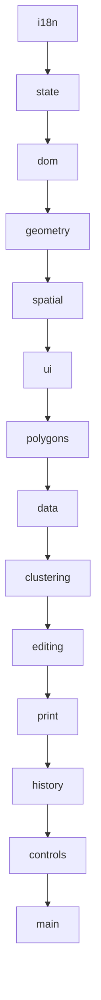

# OSM App (Territory Mapper)

Draw an area on a map, split it into territories whose edges follow real
streets, and print each one onto a card.

The output is built for the **S-12 territory card** (_Karta z mapą terenu_):
A4 portrait with a fixed map box, a red boundary line, and fields for
_Miejscowość_ and _Teren nr_. Any PDF template with a rectangular placeholder
works — the S-12 measurements are just the defaults.

Interface available in English (`/`), Polish (`/pl`) and German (`/de`).

---

## What it does

1. **Draw an outer boundary.** OSM streets and building footprints for that
   area are downloaded through Overpass.
2. **The whole area becomes one territory automatically**, so a small area is
   printable immediately without dividing it further.
3. **Split it** when you want smaller territories, either by target building
   count or by target territory count. Boundaries are routed along the street
   network rather than cutting through blocks.
4. **Adjust by hand**: draw a street-snapped cut line, merge neighbors, drop
   territories with no buildings, undo/redo throughout.
5. **Print a card.** Right-click a territory → Print. Frame it, style the
   border, erase the parts of the line that cover street names, then print
   directly or stamp it into your PDF template.
6. **Export and import** the whole state as GeoJSON.

---

## Setup

```bash
pip install .
osmapp
```

### Configuration

All optional, all environment variables.

| Variable           | Default                                          | Why you'd change it                                                                                                                    |
| ------------------ | ------------------------------------------------ | -------------------------------------------------------------------------------------------------------------------------------------- |
| `OSM_MAX_AREA_KM2` | `50`                                             | Polygons above this are refused up front. Overpass on a large area can pull hundreds of megabytes and hang for the full 180 s timeout. |
| `OVERPASS_URL`     | `https://overpass-api.de/api`                    | Point at a mirror or your own instance.                                                                                                |
| `TILE_URL`         | `https://tile.openstreetmap.org/{z}/{x}/{y}.png` | See _Tile usage_ below.                                                                                                                |
| `TILE_CACHE_DIR`   | `.tile_cache`                                    | Where proxied tiles are stored.                                                                                                        |
| `HOST` / `PORT`    | `127.0.0.1` / `5000`                             |                                                                                                                                        |
| `FLASK_DEBUG`      | `0`                                              | `1` enables the Werkzeug debugger. Never on anything reachable.                                                                        |

### Tile usage

Printing renders the basemap onto a canvas, so tiles are fetched through
`/tiles/...` rather than by Leaflet. The proxy exists for three reasons: it
keeps the canvas same-origin so `toBlob()` isn't blocked by tainting, it puts
one honest User-Agent on the requests, and it caches to disk so reprinting a
territory costs nothing.

The OSM tile policy discourages proxying and forbids bulk downloads. One card
is roughly 350 tiles across a whole editing session, which is fine for
occasional personal use. **If you print territories in volume, set `TILE_URL`
to your own or a commercial tile source.** Attribution is burned into every
rendered image.

---

## Layout

```text
*.py                      Flask: Overpass proxy, geocoding, tiles, PDF composition
templates/index.html      Page shell + every piece of UI markup as <template>
static/css/style.css      All styling; design tokens at the top
static/lang/{en,pl,de}.json
static/js/                One IIFE module per file, namespaced under window.App
static/cdn/               Vendored Leaflet plugins and Turf — no CDN at runtime
```

### Modules

Load order matters and is fixed in `index.html`:



| Module       | Responsibility                                                        |
| ------------ | --------------------------------------------------------------------- |
| `i18n`       | Dictionary loading, `t()`, translating DOM subtrees                   |
| `state`      | The single mutable store. Everything else reads `App.state`           |
| `dom`        | Clones `<template>` elements, looks nodes up by `data-role`           |
| `geometry`   | Turf wrappers, polygon normalization, planar segment noding           |
| `spatial`    | Uniform grid index, fast planar distance, binary min-heap             |
| `ui`         | Loading overlay, info panel, context menu, dialogs                    |
| `polygons`   | Territory lifecycle, hover styling, the filtered street/building view |
| `data`       | Overpass fetching, rendering, GeoJSON export/import                   |
| `clustering` | K-Means → Voronoi → street-routed boundaries                          |
| `editing`    | Cut lines, merging, cleanup                                           |
| `print`      | Canvas map rendering, framing, eraser, PDF composition                |
| `history`    | Undo/redo                                                             |
| `controls`   | Toolbar, language picker, reset                                       |
| `main`       | Boot sequence and map wiring                                          |

---

## How the pieces work

### Splitting into territories

Six phases, each yielding to the event loop so the UI stays responsive:

1. **Sample points** — building centroids, falling back to street midpoints and
   then boundary samples when an area is sparse.
2. **K-Means** → _k_ centroids.
3. **Voronoi** → cells, clipped to the outer boundary.
4. **Street graph** — an undirected weighted graph with a grid index.
5. **Edge routing** — every unique cell edge is routed along streets with A\*,
   biased toward the edge's original bearing.
6. **Polygonize** → assign pieces to centroids → fill gaps → render.

Phase 5 routes each edge **once**, keyed on its sorted endpoint pair. Adjacent
Voronoi cells share edges, and routing each cell's copy independently let A\*
return two different paths for the same edge — which breaks the planar graph
and makes `polygonize` miss rings entirely.

### Merging

`geometry.unionHealed()` grows each input by 0.5 m before unioning and shrinks
back after. A plain `turf.union` on territories whose shared boundary only
_nearly_ coincides returns a MultiPolygon of touching pieces, and Leaflet then
draws the internal outlines. Growing first closes gaps under a metre so the
union genuinely dissolves.

### Printing

The card is **rendered from scratch onto a canvas**, not screenshotted from
Leaflet. Two reasons: hiding layers can't guarantee a neighboring border stays
out of frame, whereas drawing only this territory's rings can; and a screenshot
is capped at screen resolution, while the canvas renders at 300 dpi whatever
the window size.

Three surfaces compose the result:

- **tiles** — basemap plus attribution, never erasable
- **border** — the line on transparency, with erased spans punched out using
  `destination-out`, so erasing removes the line and leaves the map beneath
- **preview** — tiles, then border at the chosen opacity

The canvas is fixed at the template placeholder's aspect ratio, so **cropping
is choosing which slice of the world lands on it** — the ratio cannot drift.
Drag to pan, scroll or slide to zoom, two buttons for quarter turns.

Two details that are easy to get wrong:

**Tiles are fetched once.** One tile zoom is chosen when the dialog opens and
never changes; tiles are cached as decoded `Image` objects for the life of the
dialog, so every later adjustment re-composites from memory with no network.
The trade is softness when zooming past that level — `TILE_ZOOM_BOOST` buys one
more sharp zoom level for roughly four times the tiles.

**Erase strokes are stored in lng/lat with a width in metres**, not canvas
pixels. In pixel space, panning after erasing would slide every erasure off the
street name it was hiding.

---

## Translations

Markup is annotated declaratively:

```html
<span data-i18n="menu.print">Print</span>
<a data-i18n-attrs="title=toolbar.draw;aria-label=toolbar.draw"></a>
```

`App.dom.render()` translates every cloned template at mount time, so no module
has to remember. Strings built in JS go through `T("key", { count: 3 })`;
`{placeholders}` interpolate and numbers are localized via `Intl.NumberFormat`.

Language comes from the URL. Flask inlines the matching dictionary plus the
English fallback into the page, so there's no fetch waterfall and no
untranslated first paint. English always loads as a fallback, so a partial
translation degrades per key rather than showing raw key names.

Console output stays English on purpose — it's developer output, and
translating it makes issue reports harder to read.

**Adding a language**: copy `static/i18n/en.json`, translate it, and add
`{ code, label }` to `LANGUAGES` in `i18n.js` and to `SUPPORTED_LANGS` in
`app.py`. Nothing else; the picker and routing pick it up.

---

## HTTP API

| Route                        | Purpose                                             |
| ---------------------------- | --------------------------------------------------- |
| `GET /`, `/pl`, `/de`        | The app. `/en` redirects to `/`                     |
| `POST /fetch_streets`        | GeoJSON polygon in, drivable street network out     |
| `POST /fetch_buildings`      | GeoJSON polygon in, building footprints out         |
| `GET /geocode?q=`            | Nominatim proxy, cached and rate-limited to 1 req/s |
| `GET /tiles/<z>/<x>/<y>.png` | Tile proxy with disk cache                          |
| `POST /compose_pdf`          | Template PDF + PNG + placement → composed PDF       |

Both fetch endpoints require the polygon on **every** request. There is no
server-side geometry cache, deliberately: a module-level one meant two browser
tabs, or any multi-worker deployment, handed users each other's areas.

---

## Keyboard

|                                        |                                                                         |
| -------------------------------------- | ----------------------------------------------------------------------- |
| `Ctrl/Cmd + Z`                         | Undo — territory geometry, or the print eraser when that dialog is open |
| `Ctrl/Cmd + Y`, `Ctrl/Cmd + Shift + Z` | Redo                                                                    |
| `Esc`                                  | Cancel drawing, merge mode, or close a dialog                           |

---

## Known limits

- Territories are stored in memory. Export to GeoJSON to keep your work.
- The partitioner is tuned for urban areas with buildings. Rural areas fall
  back to street and boundary sampling and give coarser results.
- `/compose_pdf` assumes the placeholder is a rectangle on a single page.
  Multi-page or rotated placeholders need changes to `PLACEHOLDER` in
  `print.js` and to the composition step.
- Server-side error messages are English regardless of interface language. If
  that matters, return error _codes_ from the API and map them to `alert.*`
  keys client-side.

---

## Attribution

Map data © OpenStreetMap contributors, available under the
[Open Database License](https://www.openstreetmap.org/copyright). Attribution
is rendered into every printed map. Geocoding uses Nominatim; routing data and
building footprints come from Overpass. Please read those services' usage
policies before deploying this anywhere shared.
